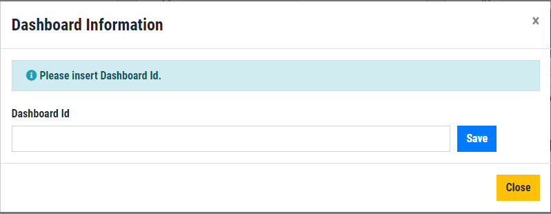
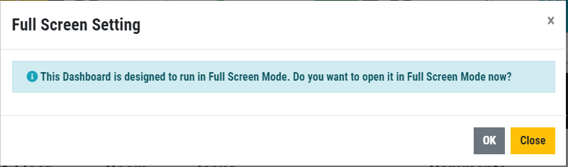
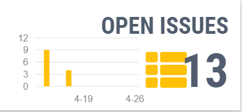
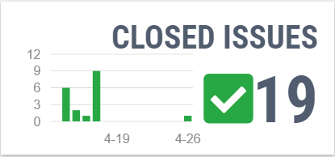
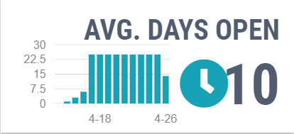
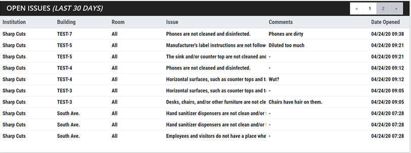
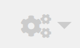
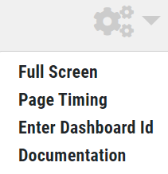
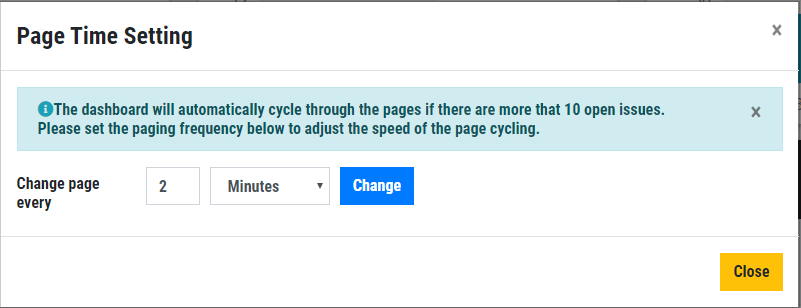

## AuditFLIX Real-Time Compliance Dashboard

### What is the AuditFLIX Dashboard?

The AuditFLIX Dashboard is a real-time dashboard that displays current compliance issues found in your environment. It is designed as a hands-off monitoring view that can be viewed on any sized device. The AuditFLIX Dashboard provided a view of open issues in realtime on a TV monitor for use in location like Security Operations Centers, Shared Work Areas, or anywhere a realtime view of current Issues and Requests are needed.

## Accessing the AuditFLIX Dashboard
The Auditflix Dashboard can be accessed by visiting [The AuditFLIX Dashboard Site] (https://auditflix.auditpro.com/). Once you have accessed the link, you will be required to enter a unique AuditFLIX Dashboard ID, which should be provide by your AuditPRO Representative.
1.	Upon successfully accessing the AuditFLIX Dashboard link, enter the unique Dashboard ID into the Dashboard Information pop-up. Select Save. 

2.	In the Full Screen display modal, select **OK** to view the Dashboard in full screen. The Dashboard is optimized to be viewed in Full Screen Mode. 

## The AuditFLIX Dashboard Display
The AuditFLIX Dashboard displays real-time AuditPRO compliance issues in various Bar Graphs and List Grids. The Bar Graphs are designed to report real-time Open Issues, Closed Issues and the Average Number of Days an Issue is open for a certain duration of time. The List Grid displays the details for each of the open compliance issues. 

### Open Issues Bar Graph
This Bar Graph displays the number of open compliance issues currently within your environment by Date and Count of Open Issues. The Bar Graph only renders for a specified length of time (ex. 30 Days). 

### Closed Issues Bar Graph
This Bar Graph displays the number of closed compliance issues currently within your environment by Date and Count of Closed Issues. The Bar Graph only renders for a specified duration of time (ex. 30 Days). 

### Average Days Open Bar Graph
This Bar Graph displays the average number of days a compliance issue is open within your environment by Date and Count of Open Issues. The Bar Graph only renders for a specified duration of time (ex. 30 Days). 

### Open Issues List Grid
The Open Issues list grid displays a list of the current open issues within your environment for a specified duration of time. The Open Issues list grid automatically cycles through the pages if there are more than 10 issues present in the list. The page cycling time can be modified based on user preference.

A variety of details are available in the Open Issues grid list to provide contextual information about each of the open issues. Please see the below definitions grid for each column type.

<table>
    <thead>
        <tr>
            <th>Grid Column</th>
            <th>Defintion</th>
        </tr>
    </thead>
    <tbody>
        <tr>
            <td>Institution</td>
            <td>The facility (physical location) in which the open compliance issue was reported.</td>
        </tr>
        <tr>
            <td>Building</td>
            <td>The building location within the facility, if multiple buildings exist, in which the open compliance issue is was reported.</td>
        </tr>
        <tr>
            <td>Department (if defined)</td>
            <td>The Department in which the open compliance issue was reported.</td>
        </tr>
         <tr>
            <td>Floor (if defined)</td>
            <td>The floor in location within the facility, if multiple floors exist, in which the open compliance issue was reported.</td>
        </tr>
        <tr>
            <td>Room </td>
            <td>The room location within the building and facility in which the open issue was reported.</td>
        </tr>
        <tr>
            <td>Issue </td>
            <td>A brief description of the compliance issue that needs to be addressed.</td>
        </tr>
        <tr>
            <td>Comments </td>
            <td>Comments entered by the person who reported the issue.</td>
        </tr>
         <tr>
            <td>Date Opened </td>
            <td>The date and time in which the issue was reported.</td>
        </tr>              
    </tbody>
</table>

## AuditFLIX Settings Options
The AuditFLIX Settings options controls a variety of functionality from viewing in Full Screen Mode, setting Page Change Timing, entering the IDs and navigating a user to supporting AuditFLIX Help Documentation. It is accessible from the  icon in the upper right of the dashboard.

Below is a list of the AuditFLIX Settings Options

### Full Screen Settings Option
This settings option allows the user to control viewing the AuditFLIX Dashboard in Full Screen.
<ul>
    <li>Selecting <strong>OK</strong> will displays the dashboard in Full Screen Mode.</li>
    <li> Selecting <strong>Close</strong> will displays the dashboard in your browsers default orientation.</li>
</ul>

### Page Timing Settings Option
This settings option allows a user to control the speed of the page cycling for the Open Issues Grid. The Dashboard automatically cycles through pages if there are more than 10 open issues. A user can select the frequency based on their preference. 

### Enter Dashboard ID
This settings option allows a user to enter in various Dashboard IDs to view the appropriate AuditFLIX Dashboard. 

### Documentation Link
This settings option leads the user to the AuditFLIX Real-Time Compliance Dashboard help pages. Don’t look to far, you are already here! These help pages provide instructional information in navigating and understanding the AuditFLIX Dashboard. 

### Additional Help
For existing users with questions or for more help, please send an email to <a href="email:support@auditpro.com">Our Support Team</a>.

For licensing inquiries, please send an email to <a href="email:sales@auditpro.com">Our Support Team</a>.
